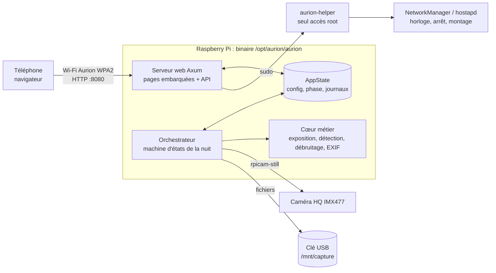
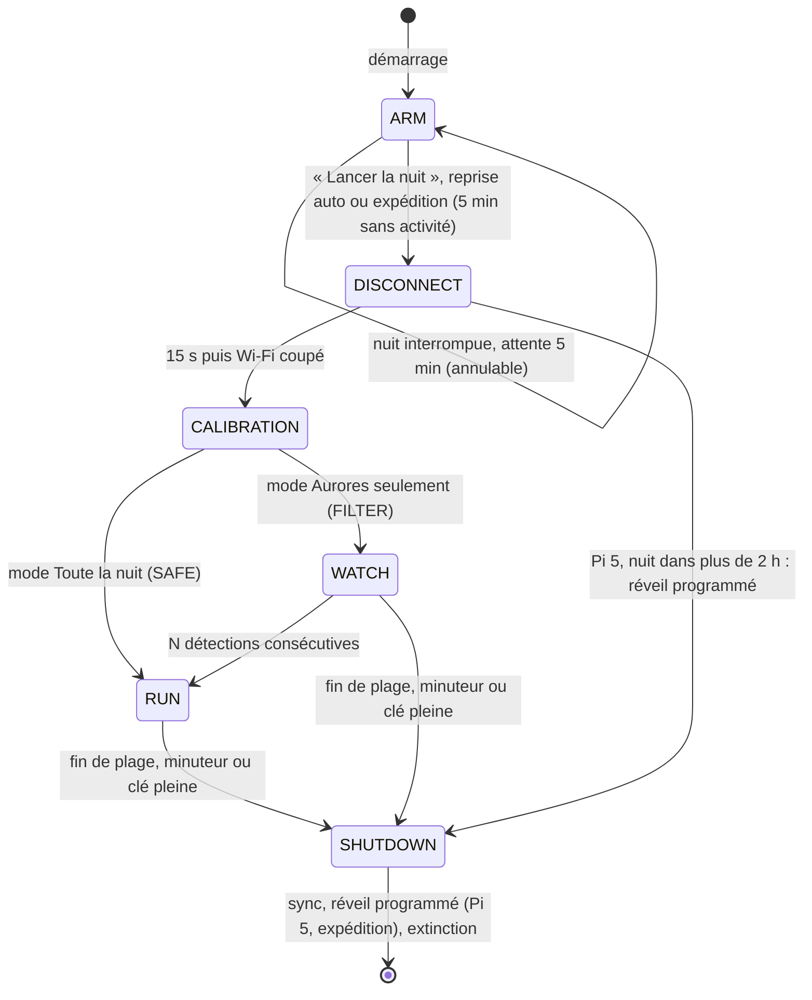
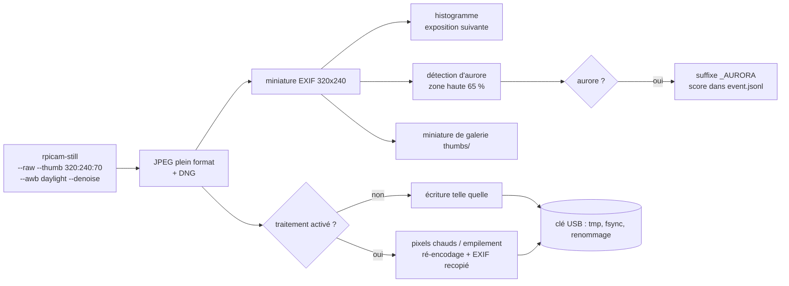
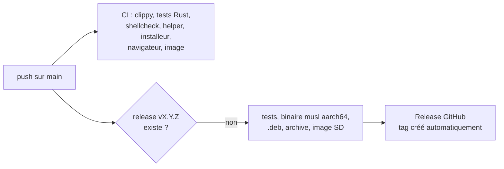

# Dossier d'Architecture Technique (DAT)

Version couverte : **1.8.0**. Public : développeurs, relecteurs, mainteneurs.

## 1. Objet et contexte

Aurion transforme un Raspberry Pi et une caméra HQ (IMX477) en caméra autonome de chasse aux aurores :
on la pose le soir, on lance la nuit depuis le téléphone, elle photographie seule, s'éteint seule, et le
lendemain on récupère les photos (RAW DNG et JPEG) et la liste des images avec aurore.

Analogie : un piège photographique pour la faune, mais pour le ciel. On le règle une fois, on s'en va, et
on relève la carte mémoire le lendemain.

### Exigences structurantes

| # | Exigence | Conséquence d'architecture |
|---|---|---|
| X1 | Utilisable sans connaissance informatique | image carte SD prête à flasher, installation automatique au premier démarrage, Wi-Fi propre au Pi, portail captif, interface en français |
| X2 | Nuit entièrement autonome, sans réseau | orchestrateur embarqué, aucune dépendance à internet, horloge réglée depuis le téléphone |
| X3 | Sur batterie | un seul binaire natif (Rust), analyse sur miniature EXIF, Wi-Fi coupé la nuit, matériel inutile désactivé |
| X4 | Aucune donnée corrompue en cas de coupure | écritures atomiques avec fsync, réparation de la clé au montage, reprise de la nuit après coupure |
| X5 | Photos exploitables par un professionnel | RAW DNG natif du capteur, balance des blancs fixe, exposition verrouillable, darks, classement des aurores |
| X6 | Sécurité d'un appareil pilotable par Wi-Fi | un seul point d'entrée root validé, anti-CSRF, anti-DNS-rebinding, secrets jamais exposés |

## 2. Vue d'ensemble

Un seul processus (`aurion run`, service systemd) contient le serveur web et l'orchestrateur. Ils partagent
un état (`AppState`) protégé par des verrous asynchrones. Tout ce qui demande les droits root passe par
`aurion-helper`, un script court qui revalide chaque argument.

## 3. Architecture logicielle (hexagonale)

Le cœur ne connaît pas le matériel : il parle à des **ports** (traits Rust). Des **adapters** branchent soit le
vrai matériel (`adapters/rpi`, compilé avec `--features rpi`), soit des simulateurs (`adapters/pc`) pour le
développement et les tests. Analogie : une prise électrique standard, sur laquelle on branche le vrai appareil
sur le terrain ou un appareil de test à l'atelier.

| Dossier | Rôle | Fichiers clés |
|---|---|---|
| `src/core/` | règles métier pures, testables sans matériel | `orchestrator.rs` (déroulé de la nuit), `exposure.rs`, `detection.rs`, `denoise.rs`, `jpeg.rs` (EXIF), `night.rs` (reprise après coupure), `config.rs`, `validate.rs`, `session_logger.rs`, `state_machine.rs`, `models.rs` |
| `src/ports/` | contrats | `camera`, `storage`, `clock`, `network`, `system` |
| `src/adapters/rpi/` | matériel réel | `camera_rpi.rs` (`rpicam-still`), `storage_rpi.rs` (fsync), `network_rpi.rs` et `system_rpi.rs` (via le helper) |
| `src/adapters/pc/` | simulateurs | `CameraMock` (ciels synthétiques, pannes), `StorageMock`, `NetworkMock`, `SystemMock`, `TokioClock` (temps virtuel) |
| `src/web/` | interface | `mod.rs` (routes, état), `api.rs`, `gallery.rs`, `security.rs`, `captive.rs`, `static_files.rs`, `static/` (pages) |
| `src/cli/` | outils | `simulate` (nuit simulée), `bench` (coût des traitements) |
| `src/sys.rs` | commandes système | appel du helper, `statvfs`, santé du stockage |

### Choix techniques

| Choix | Raison | Alternative écartée |
|---|---|---|
| Rust, binaire statique musl aarch64 | mémoire et CPU minimaux, un seul fichier, fonctionne sur Bullseye, Bookworm et Trixie | Python (interpréteur, dépendances, consommation) |
| Tokio limité à 2 threads | moins de réveils CPU | runtime par défaut (un thread par cœur) |
| Axum + pages embarquées (`rust-embed`) | aucune installation web séparée, mise à jour = un fichier | serveur web externe |
| HTML/CSS/JS sans framework ni police externe | fonctionne hors ligne, pages légères | framework JS (poids, build) |
| `rpicam-still` en sous-processus | outil officiel, gère le DNG et l'ISP | libcamera en direct (complexité, liaison C++) |
| Crate `image` limitée à JPEG et PNG | taille du binaire | toutes les features |

## 4. Déroulé d'une nuit (machine d'états)

| Phase | Ce qui se passe | Code |
|---|---|---|
| ARM | hotspot actif, interface disponible, réglages modifiables, heure synchronisée depuis le téléphone (ou lue sur l'horloge matérielle au démarrage) ; en expédition, départ automatique 5 min après la dernière requête `/api/` si l'heure est fiable et la clé présente | `main.rs`, `web/`, `orchestrator::wait_for_start` |
| (reprise) | si `night.json` existe et que la nuit n'est pas finie : hotspot 5 min avec compte à rebours, puis reprise | `orchestrator::resume_window`, `core/night.rs` |
| DISCONNECT | 15 s pour que la réponse arrive au téléphone, puis arrêt du hotspot | `orchestrator::run` |
| CALIBRATION | 3 poses d'essai pour caler ISO et temps de pose | `exposure.rs` |
| WATCH | une pose JPEG toutes les `watch_interval_secs` (60 s), jamais de RAW, rien n'est enregistré ; profil d'énergie « watch » | `detection.rs`, `orchestrator` |
| RUN | poses à la suite (pause `capture_interval_secs`, 0 par défaut ; plancher de sécurité de 1 s par cycle), profil « capture », enregistrement JPEG et/ou DNG, marquage `_AURORA` ; en FILTER, une fois l'aurore confirmée la capture continue jusqu'à la fin (pas de retour en WATCH) | `orchestrator::save_frame` |
| SHUTDOWN | journal vidé, `sync`, suppression de `night.json`, extinction ; déclenché aussi quand la clé passe sous le seuil critique (5 % ou 50 Mo libres) | `orchestrator::run` |

Attente : en mode plage horaire, si la nuit est lancée avant l'heure de début, l'orchestrateur attend (contrôle
toutes les 60 s). En mode minuteur, la durée part du lancement.

## 5. Chaîne de traitement d'une image

Points clés :
- l'analyse ne décode jamais l'image 12 Mpx : elle lit la miniature que `rpicam-still` glisse dans l'EXIF
  (environ 230 fois moins de calcul, mesuré par `aurion bench`) ;
- le DNG n'est jamais modifié : c'est le fichier natif du capteur, destiné au post-traitement ;
- les traitements optionnels (pixels chauds, empilement) ne touchent que le JPEG ; voir GUIDE_PHOTO.md.

## 6. Données et stockage

### Clé USB (`/mnt/capture`, exFAT ou FAT32)

| Chemin | Contenu |
|---|---|
| `sessions/AAAA-MM-JJ_HH-MM/JPG/aurora_AAAAMMJJ_HHMMSS_NNNNN[_AURORA].jpg` | JPEG, numéro d'image sur 5 chiffres (continu après une reprise) |
| `sessions/…/RAW/aurora_….dng` | DNG natifs, même nom que leur JPEG |
| `sessions/…/JPG/aurora_…_STACK.jpg` | JPEG empilé (si activé) |
| `sessions/…/thumbs/` | miniatures de galerie |
| `sessions/…/event.jsonl` | un événement JSON par image (phase, exposition, score, numéro d'image) |
| `sessions/…/session.log` | journal lisible de la nuit (config effective, erreurs) |
| `sessions/…/aurores.csv` | images avec aurore triées par score (image, heure, score, couleur, JPG, RAW), écrit en fin de nuit |
| `aurora_*.jpg|dng`, `thumbs/` à la racine | captures des versions antérieures à 1.7, toujours affichées par la galerie |
| `darks/` | séries de darks |
| `aurion-reset-wifi.txt` | déposé par l'utilisateur : remet le mot de passe Wi-Fi d'usine au démarrage (renommé `.done`) |

### Carte SD

| Chemin | Contenu | Droits |
|---|---|---|
| `/opt/aurion/aurion` (+ `.prev`) | binaire (et version précédente après mise à jour) | 0755 |
| `/opt/aurion/config/aurion.json` | configuration | 0600, service |
| `/opt/aurion/config/presets/` | presets utilisateur | 0700 |
| `/opt/aurion/config/night.json` | nuit en cours (reprise après coupure), supprimé en fin normale | 0600 |
| `/usr/local/sbin/aurion-helper` | helper root | 0755 root |
| `/etc/sudoers.d/aurion` | autorise uniquement le helper | 0440 |
| `/etc/systemd/system/aurion.service` | service | 0644 |
| `/etc/udev/rules.d/99-aurion-usb.rules` | montage automatique de toute clé USB | 0644 |

Journaux système en RAM (`journald Storage=volatile`, 50 Mo), `/tmp` en tmpfs, racine en `noatime` : la carte SD
n'est presque jamais écrite.

## 7. Réseau

| Élément | Valeur |
|---|---|
| Hotspot | SSID `Aurion`, WPA2-PSK, canal 6 par défaut, IP du Pi `192.168.4.1` |
| Pilote | NetworkManager (mode partagé) ; repli hostapd + dnsmasq (DHCP 192.168.4.10 à .50) |
| Portail captif | DNS qui répond 192.168.4.1 pour tout nom ; port 80 redirigé vers 8080 (nftables) ; routes de détection iOS, Android, Windows redirigées vers l'interface |
| Interface | `http://192.168.4.1:8080` (HTTP, réseau fermé) |
| Nuit | hotspot arrêté, radio Wi-Fi coupée |
| Changement du Wi-Fi depuis l'interface | appliqué 3 s après l'enregistrement (redémarrage du hotspot) |

## 8. Sécurité (résumé, détail dans AUDIT_SECURITE.md)

- **Un seul point root** : `aurion-helper` avec liste fermée de commandes et validation de chaque argument ;
  secrets passés sur l'entrée standard.
- **HTTP** : écritures refusées si `Origin` ne correspond pas à `Host` ou si `Sec-Fetch-Site: cross-site` (CSRF) ;
  `Host` limité aux adresses IP, `localhost`, `*.local` et au nom d'hôte (DNS rebinding) ; CSP stricte,
  `X-Frame-Options: DENY`, `nosniff` ; corps limité à 1 Mo (128 Mo pour la mise à jour).
- **Entrées** : tous les noms (fichiers, sessions, presets), SSID, mots de passe, dates et fuseaux passent par
  `core/validate.rs`.
- **Secrets** : le mot de passe Wi-Fi n'est jamais renvoyé par l'API (masqué), ni stocké dans un preset.
- **Mise à jour** : contrôle ELF (architecture, type), exécution d'essai, remplacement atomique, refus pendant la nuit.

## 9. Fiabilité et énergie (détail dans ENERGIE_ET_FIABILITE.md)

| Risque | Parade |
|---|---|
| Coupure pendant l'écriture d'une photo | fichier temporaire, fsync, renommage, fsync du dossier |
| Clé « sale » après coupure | `systemd-mount --fsck=yes` à chaque montage |
| Nuit interrompue (batterie vide, changée) | `night.json` : reprise automatique au redémarrage, bornée à la fin prévue, 3 fois au plus, dans le même dossier de nuit ; fichiers `.part` nettoyés |
| Des dizaines de milliers de photos (expédition) | un dossier par nuit ; galerie paginée (1000 images récentes, filtre par nuit) ; estimation de capacité sur un échantillon de la dernière nuit |
| Démarrage automatique en plein jour | jamais sans heure fiable (téléphone ou horloge matérielle) ; la plage horaire décide de la capture |
| Horloge fausse après coupure (Pi 4 sans horloge sauvegardée) | réévaluation après la fenêtre de 5 min (le téléphone corrige l'heure s'il se connecte) ; durée reprise plafonnée |
| Blocage | watchdog systemd (`WatchdogSec=180`, battement toutes les 30 s) et watchdog matériel |
| Sous-tension persistante | `aurion-power-watch` : 3 contrôles de suite, puis `sync` et extinction propre |
| Caméra en panne | 5 échecs consécutifs : pause 5 min puis nouvel essai, la nuit continue |

Énergie : analyse sur miniature, aucun ré-encodage par défaut, Wi-Fi coupé la nuit, Bluetooth, audio et LED
désactivés, services inutiles arrêtés, 2 threads, rafraîchissement de l'interface suspendu quand l'écran du
téléphone est éteint. Le jour : extinction après chaque nuit ; un Pi 5 attend éteint (alarme RTC via
`aurion-helper rtc-wake`) au lieu d'attendre allumé.

## 10. Construction et livraison

| Livrable | Construit par | Usage |
|---|---|---|
| `aurion-X.Y.Z-raspios-arm64.img.xz` | `scripts/build-image.sh` (Raspberry Pi OS Lite 64 bits + Aurion, installation au premier démarrage) | utilisateur final : Raspberry Pi Imager |
| `aurion_X.Y.Z_arm64.deb` | `scripts/package.sh` | Pi déjà installé : `sudo apt install ./…deb` |
| `aurion-X.Y.Z-rpi-arm64.tar.gz` | `scripts/package.sh` | `install.sh`, `deploy.sh`, `deploy.ps1` |
| binaire `aurion` seul | idem | mise à jour depuis l'interface (Diagnostics) |

Publier une version : changer `version` dans `Cargo.toml` et pousser sur `main`. Chaque push sur `main` publie
aussi la pré-release **edge** (workflow `edge.yml`, binaire `aurion-arm64` seul, version `X.Y.Z-edge.<commit>`),
installable depuis le téléphone (voir GUIDE_DEVELOPPEMENT.md).

## 11. Interfaces (API HTTP)

Toutes les routes sont en JSON sauf mention. Les écritures (`POST`, `DELETE`) sont soumises à l'anti-CSRF.

| Route | Rôle |
|---|---|
| `GET /api/preflight` | vérifications avant la nuit (caméra, clé et autonomie, heure et sa source, alimentation, température, mot de passe, expédition), `ready`, reprise, départ automatique, nuits possibles, réveil possible |
| `GET /api/night/last` | résumé de la dernière nuit (photos, aurores, RAW, meilleur score) |
| `POST /api/night/resume/cancel` | annuler la reprise d'une nuit interrompue |
| `POST /api/disconnect` | lancer la nuit (ou reprendre tout de suite) |
| `GET /api/status` | phase, heure, stockage, alertes |
| `GET/POST /api/config` | configuration (mot de passe masqué) |
| `GET/POST /api/presets`, `POST /api/presets/:name/apply`, `DELETE /api/presets/:name` | presets |
| `GET /api/preview`, `POST /api/preview/capture` | aperçu |
| `GET/POST /api/darks` | série de darks |
| `GET /api/storage`, `/api/logs`, `/api/diagnostics` | supervision |
| `POST /api/system/time`, `/api/system/shutdown`, `/api/system/update` | heure, arrêt, mise à jour par fichier |
| `POST /api/system/update/online`, `GET /api/system/update/status`, `POST /api/system/rollback` | mise à jour depuis GitHub (stable ou `edge`), résultat et version du helper, retour à la version précédente |
| `GET /api/wifi/scan`, `/api/wifi/status`, `POST /api/wifi/connect`, `/api/wifi/hotspot` | mode maintenance (Wi-Fi de la maison) |
| `GET /api/gallery[?session=<nuit>&limit=N]` | images (1000 plus récentes par défaut, `truncated` si plus) |
| `GET /api/gallery/stats`, `/api/gallery/sessions`, `/api/gallery/best` | galerie (sessions avec nombre de RAW) |
| `GET /api/gallery/sessions/:name/download[?only=raw\|jpg]` | ZIP d'une nuit, tout, RAW seuls ou JPEG seuls (flux, sans fichier temporaire) |
| `GET /api/gallery/:file`, `/api/gallery/thumbnail/:file` | image, miniature |
| `POST /api/gallery/delete`, `/api/gallery/download-zip`, `DELETE /api/gallery/sessions/:name` | sélection |

## 12. Limites connues

- Pas encore validé sur le matériel réel : hotspot NetworkManager, montage udev, options `rpicam-still`,
  seuils de détection sur de vraies aurores, premier démarrage de l'image (voir PLAN_ACTION.md, V1 à V5).
- Sur Pi 4 sans module horloge, l'heure après une coupure dépend de la dernière heure connue : la reprise est
  bornée, mais la fin de nuit peut être décalée tant qu'aucun téléphone ne s'est connecté ; le départ automatique
  de l'expédition attend une heure fiable.
- Réveil programmé du Pi 5 et module DS3231 non encore validés sur le matériel (PLAN_ACTION.md, V8 et V9).
- Pas d'authentification applicative : la clé Wi-Fi fait office de mot de passe.
