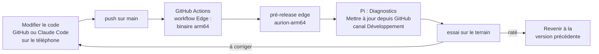

# Guide de développement : essai, erreur, correction, au plus vite

Version couverte : **1.8.0**. But : corriger Aurion à la volée, même en voyage, **sans ordinateur**, et tester
sur le Raspberry Pi en quelques minutes.

Analogie : comme la mise à jour d'une application sur le téléphone, mais avec deux canaux. *Stable* pour les
nuits importantes, *Développement* pour les essais, et un bouton pour revenir en arrière.

## 1. La boucle depuis le téléphone (sans ordinateur)



1. **Modifier** : sur le téléphone, dans l'application GitHub, sur github.com ou avec Claude Code, puis enregistrer
   sur `main`.
2. **Construire** : le workflow **Edge** (`.github/workflows/edge.yml`) recompile le binaire Raspberry Pi à chaque
   modification de `main` et le publie dans la pré-release **edge** (fichier `aurion-arm64`). Le suivi se fait dans
   l'onglet *Actions* du dépôt. Le canal stable n'est pas touché.
3. **Installer** : sur le téléphone connecté au Wi-Fi Aurion, *Diagnostics*, **Mettre à jour depuis GitHub** :
   - Version : **Développement** ;
   - nom et mot de passe du **partage de connexion** du téléphone (enregistrés pour la fois suivante) ;
   - **Mettre à jour maintenant**, puis activer le partage de connexion.

   Aurion coupe son Wi-Fi, rejoint le partage de connexion (il réessaie pendant 2 minutes, le temps de l'activer),
   télécharge, vérifie le fichier (binaire Linux arm64 qui démarre), l'installe, puis redémarre sur son propre Wi-Fi.
   Reconnectez-vous au Wi-Fi Aurion : la page *Diagnostics* affiche la version (par exemple
   `1.8.0-edge.1a2b3c4`, le code du commit) et le résultat.
4. **Revenir en arrière** : **Revenir à la version précédente** sur la même page. Le même bouton refait l'échange
   dans l'autre sens.

À la maison, le Pi peut rester sur le Wi-Fi de la maison (*Connexion Wi-Fi (maintenance)*) : laisser alors le
champ *Partage de connexion* vide, le téléchargement utilise la connexion actuelle.

### Ce qu'une mise à jour par GitHub ne change pas

Elle remplace l'application (`/opt/aurion/aurion`), pas le programme système `aurion-helper` qui tourne en root.
Laisser le Pi réécrire son propre programme root avec un fichier téléchargé ouvrirait une faille. Quand le helper
change (nouvelle commande système), *Diagnostics* l'indique ; il faut alors installer une fois l'image carte SD ou
le paquet `.deb` de la version. Version actuelle du helper : 2 (commandes `power-profile`, `rtc-wake`, `version`).

## 2. La boucle avec un ordinateur (la plus rapide)

```bash
scripts/deploy.sh pi@aurion.local            # compile pour le Pi, copie et installe tout (helper compris)
cargo run -- serve --port 8080               # interface avec caméra simulée, sur l'ordinateur
cargo run -- simulate                        # nuit simulée dans la console
cargo test                                   # tous les tests (nuits entières en temps virtuel)
```

## 3. Mesurer pour décider

| Question | Où regarder |
|---|---|
| Durée réelle d'une prise (au-delà du temps de pose) | `sessions/<nuit>/event.jsonl`, champ `capture_ms` (comparer avec `exposure_us`) |
| Débit réel sur la clé | accueil : autonomie calculée sur la dernière nuit |
| Coût des traitements sur le Pi | `/opt/aurion/aurion bench` |
| Journal de la nuit | `sessions/<nuit>/session.log` |
| Alimentation, température | accueil (vérifications), *Diagnostics* |

Essais utiles à faire sur le matériel (PLAN_ACTION.md) :
- **Prise directe** (*Réglages experts*, option expérimentale `--immediate`) : comparer `capture_ms` avec et sans ;
- **ISO maximal utile en RAW** (V10) ;
- **réveil du Pi 5** (V8), **module horloge sur Pi 4** (V9).

## 4. Règles pour ne rien casser

- Chaque correction a son test (`tests/`), lancé automatiquement par la CI à chaque push.
- Une nuit importante se fait en version **stable** ; le canal développement sert aux essais.
- Une mise à jour est refusée pendant une nuit ; le binaire précédent reste toujours disponible.
